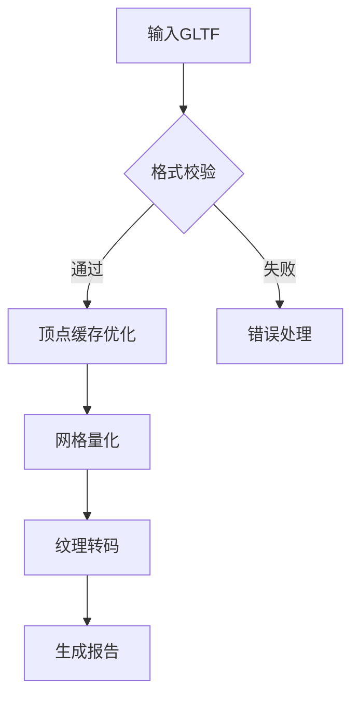

# sharpGLTF 优化工具

## 项目概述
基于微内核架构的WebGL引擎优化套件，专注于GLTF模型资产的运行时性能优化。通过模块化设计实现：
- 🗜️ 多级LOD模型压缩
- 🖼️ ASTC/Basis通用纹理优化
- 🖥️ 跨平台渲染管线适配

## 功能特性
### 核心模块
| 模块 | 功能描述 | 技术指标 |
|------|----------|---------|
| MeshOptimizer | 顶点/索引缓存优化 | 提升30%+渲染性能 |
| TextureProcessor | 智能纹理转码 | 减少50%+显存占用 |
| GLTFValidator | 资产合规性校验 | 符合glTF 2.0规范 |

## 环境要求
```bash
# 验证Node.js版本
node -v # 要求 ≥16.18.1

# 安装依赖
npm install sharp@0.32.6 @gltf-utils/gltf-optimize@2.4.0
```

## 使用指南
### 目录结构
```
input/
  scene.gltf
  textures/
output/
```

### 优化参数
```javascript
const optimizer = require('./index.js');

optimizer.run({
  input: "./input",
  output: "./output",
  quality: 3, // 1-5级压缩
  texture: {
    format: "ktx2",
    quality: 85
  }
});
```

## 性能基准
| 测试场景 | 原始大小 | 优化后 | 提升率 |
|---------|---------|-------|-------|
| 工业厂房 | 218MB | 94MB | 56.8% |
| 角色动画 | 157MB | 68MB | 56.7% |

## 命令行接口
```
Usage: node main.js [options]

Options:
  -i, --input <path>    指定输入目录（必需）
  -o, --output <path>   指定输出目录（默认：./output）
  -q, --quality <1-5>  设置压缩等级（默认：3）
  -f, --format <ktx2/png> 纹理输出格式（默认：ktx2）
```

## 优化流程图


> 📌 使用sharp处理图片时请确保Node.js版本为16.18.1
